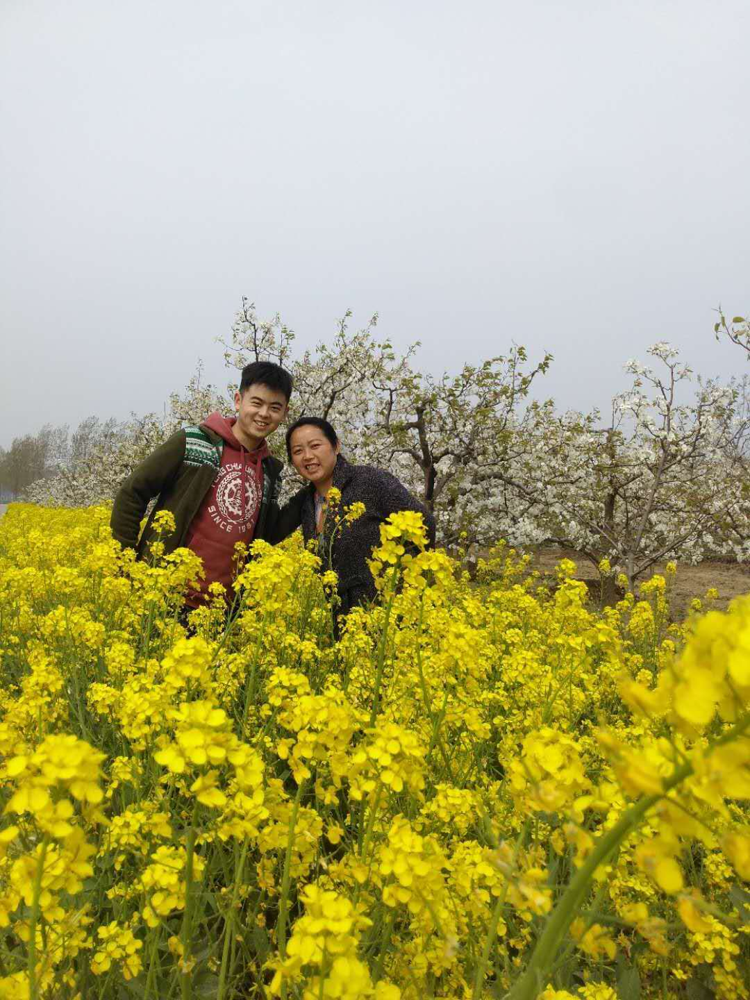
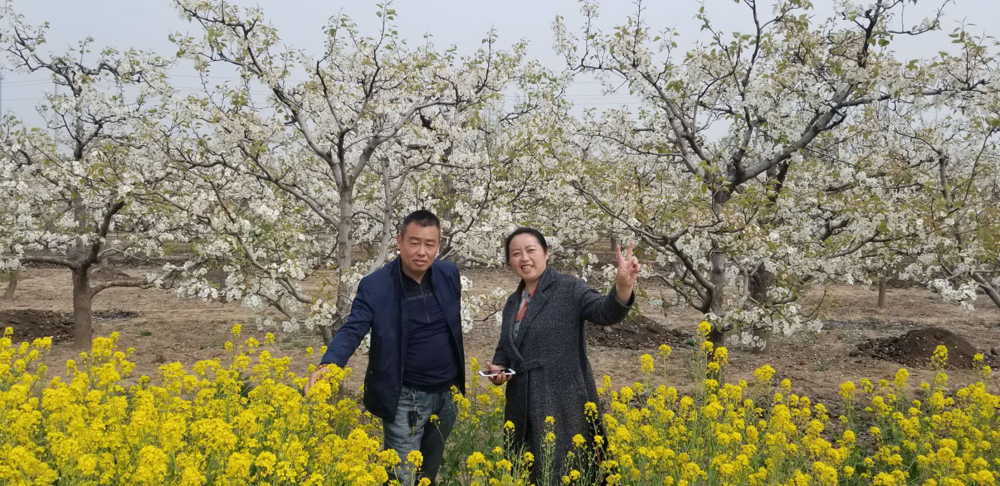

# 妈妈生日快乐

<iframe frameborder="no" border="0" marginwidth="0" marginheight="0" width=330 height=86 src="//music.163.com/outchain/player?type=2&id=1474598888&auto=1&height=66"></iframe>

天再高，高不过妈妈的怀抱；海再深，深不过妈妈的牵挂；路再远，仍想起妈妈叮嘱的话。您给了我们生命；您给了我们温暖；您给了我们道理；您给了我们希望；您给了伟大的母爱。

无论儿女 在外总是想着自己的父母，因为父母才是他们最温暖的港湾。  

 孩子大了 你们也该享受自己的生活了，你们要知道： 只有父母过得快乐安逸 当儿女的才会开心 才会放心。

#### 当我们不在身边，在外面打拼的时候，您在抚养我们的地方岁月静好，这才是我们乘风破浪的动力和信心

#### 幸福快乐是我们一起刻意努力练习的结果，保持开心，保持健康

#### 岁月易逝，但未来还有很多故事，要积极健康，因为世界还很大，我们要一起旅行下去

#### 儿女真正希望的 不是父母一直陪在身旁，而且 即使儿女不在身旁 他们也能安逸快活的过日子，这也是爱儿女的表现。
     

#### 乌云会有，但阳光尚好

老天爷是公平的，虽然我们不是显贵人家，但好在家庭完整。只要一颗平常心，认真生活，保持健康和信心，
永远对已有的珍贵之物不习以为常，永远对未来一切有美好期盼，那么就有家和万事兴。

#### 生活中一点一滴都值得幸福起来，就像拔丝红薯的微微丝线

丝线和思念都看起来细小飘渺，但我们一直记得口里的甜和心里的甜

