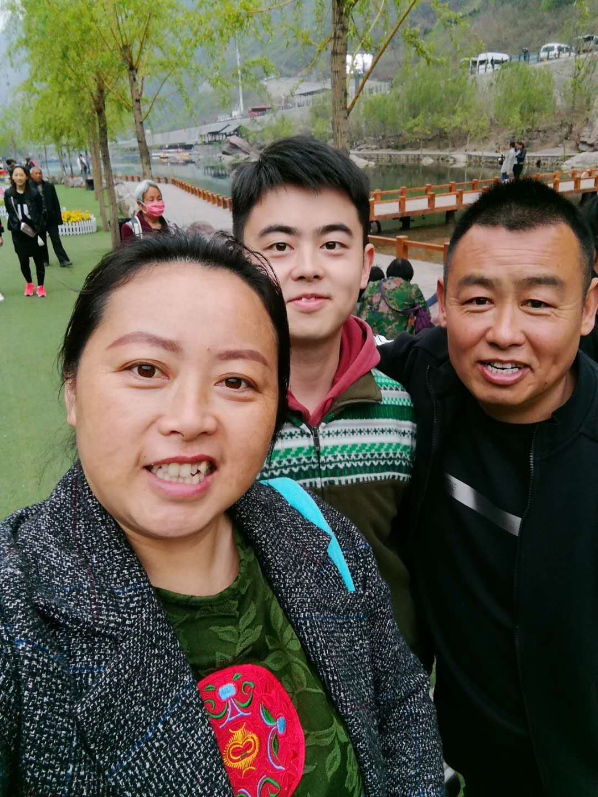
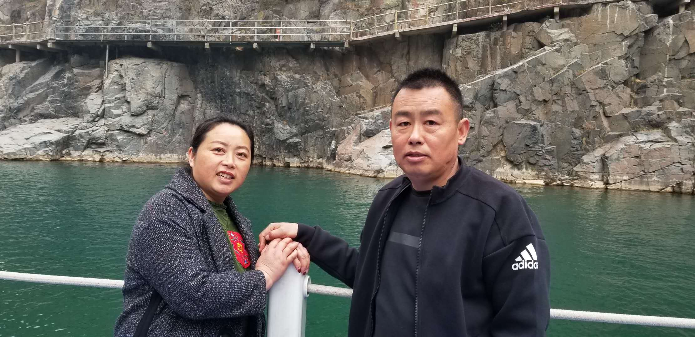
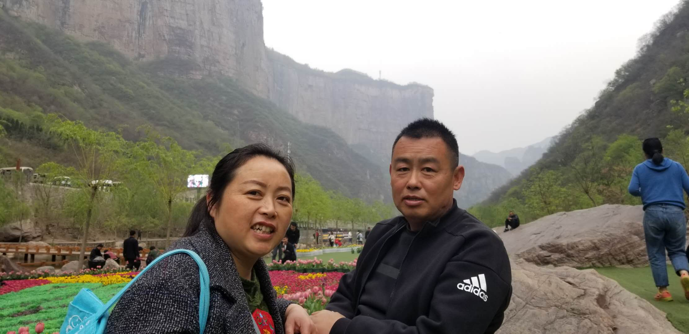

# 母亲节快乐

天再高，高不过母亲的怀抱；海再深，深不过母亲的牵挂；路再远，仍想起母亲叮嘱的话。您给了我们生命；您给了我们温暖；您给了我们道理；您给了我们希望；您给了伟大的母爱。

无论儿女 在外总是想着自己的父母，因为父母才是他们最温暖的港湾。               孩子大了 你们也该享受自己的生活了，你们要知道 只有父母过得快乐安逸 当儿女的才会开心 才会放心。

儿女真正希望的 不是父母一直陪在身旁，而且 即使儿女不在身旁 他们也能安逸快活的过日子，这也是爱儿女的表现。

